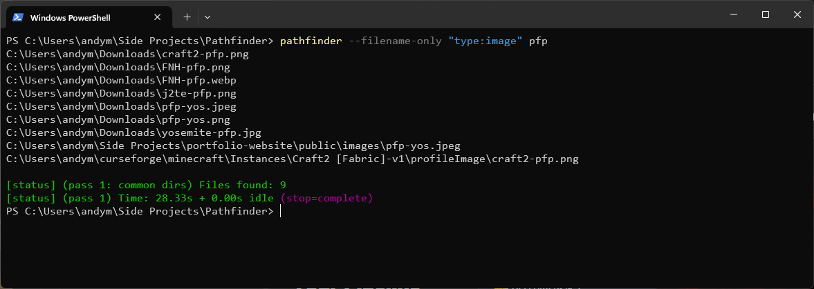
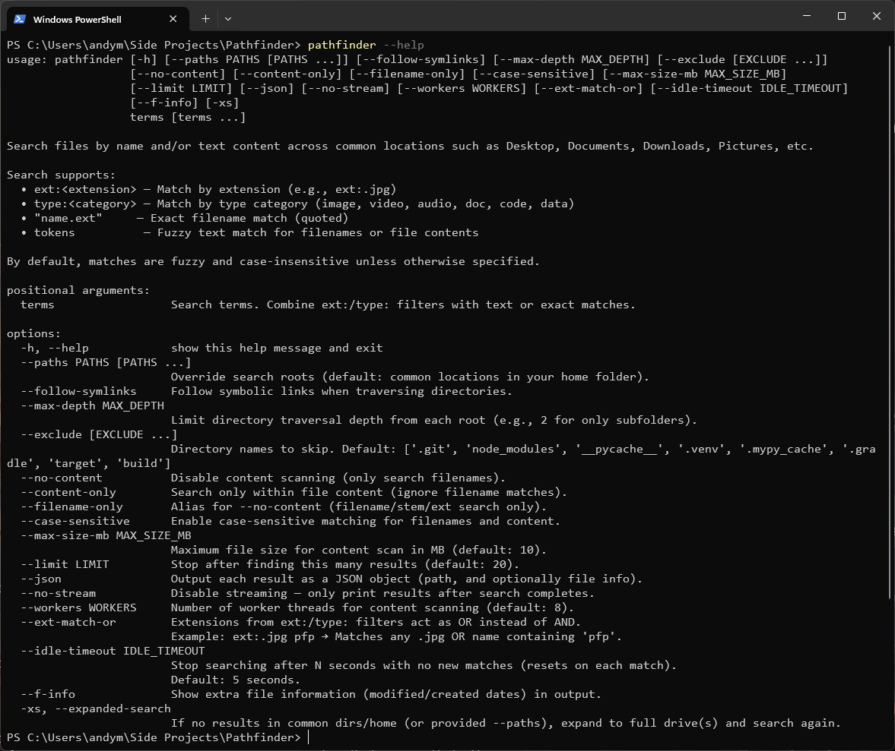

# Pathfinder

A Python cli program to search for files by **name** and **(text) content**.  
By default, it searches common user folders with names like; Desktop, Documents, Downloads, Pictures, Screenshots etc.


## Features
- Search by filename (substring or exact).
- Search inside text-based files (utf-8/latin-1 tolerant).
- Quoted filters:
  - `".pdf"` matches file extension `.pdf`.
  - `"pfp.jpeg"` matches exact filename.
  - `"pfp"` matches exact stem (filename without extension).
- Simple relevance scoring (filename, extension, content hits).
- Cross-platform: macOS / Linux / Windows.

## Pre-reqs
- Python3.9+

## Install (editable dev mode)
```bash
pip install -e .
```
## Run (basic)
```bash
pathfinder --filename-only "type:image" pfp
```

 
